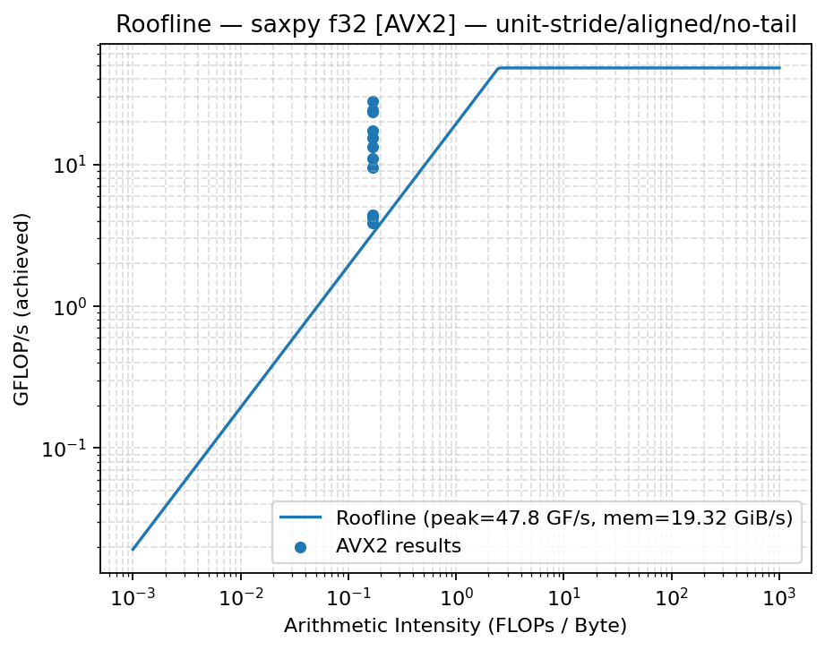

# Project 1 — Vector Kernels: Alignment, Stride, Locality, Roofline & Tails

This project profiles simple vector kernels (dot, mul, SAXPY, stencil) to study:
- **Alignment** (scalar vs SIMD/AVX2)
- **Stride** (spatial locality & prefetching)
- **Working-set locality** (L1 → L2 → LLC → DRAM)
- **Roofline** placement (compute vs bandwidth ceilings)
- **Tail-latency** behavior (run-to-run variability)

All raw/cleaned CSVs, scripts, and figures live in this folder.  
Project report PDF (full write-up): `Project 1 Report (1).pdf`

---

## What’s in here
- `results_ascii.csv` → raw measurements  
- `results_clean.csv` → normalized data (created by `clean_csv.py`)  
- Plotters: `plot_alignment.py`, `plot_stride.py`, `plot_locality.py`, `plot_roofline.py`, `plot_tail.py`  
- Figures: `*.png` in this directory

**Reproducing figures (conceptual steps, no shell required):**
1. Ensure Python 3 with `pandas`, `numpy`, and `matplotlib` is available.
2. Normalize raw data → `results_clean.csv` with `clean_csv.py`.
3. Generate figures with the plot scripts (they read `results_clean.csv`) and save PNGs in this directory.

---

## Figures (with captions)

### Alignment (SIMD vs scalar, alignment/tail effects)
**All alignment variants across kernels/modes.**  

**SAXPY f32 with AVX2 — benefit of wide vectors under good alignment.**  

---

### Stride (spatial locality & prefetch)
**All stride variants — throughput drops as stride increases (poorer line utilization/prefetch).**  

**Dot f32 with AVX2 — unit-stride vs strided access.**  

**Dot f32 at N = 1,048,576 — stride impact at a fixed large working set.**  

---

### Locality (working-set transitions)
**SAXPY f32 SIMD — throughput vs working-set; cache transitions visible.**  

**Same sweep reported as GiB/s.**  

**SAXPY f32 AVX2 — locality with wider vectors.**  

**Annotated curve — marked L1/L2/LLC/DRAM regions.**  

**Cycles per element (CPE) view of the same locality sweep.**  

---

### Roofline (compute vs bandwidth bound)
**SAXPY f32 AVX2 — achieved GFLOP/s vs measured ceilings.**  

**SAXPY f32 SIMD — alternate roofline placement.**  

---

### Speedups (scalar → SIMD)
**Dot product: f32 / f64 speedups.**  
  

**Elementwise multiply: f32 / f64 speedups.**  
  

**SAXPY: f32 / f64 speedups.**  
  

**Stencil: f32 / f64 speedups.**  
  

---

### Tail latency (run-to-run variability)
**Distribution of runs (tails) across kernels.**  

**Tail behavior for mul f64 (AUTO configuration).**  

