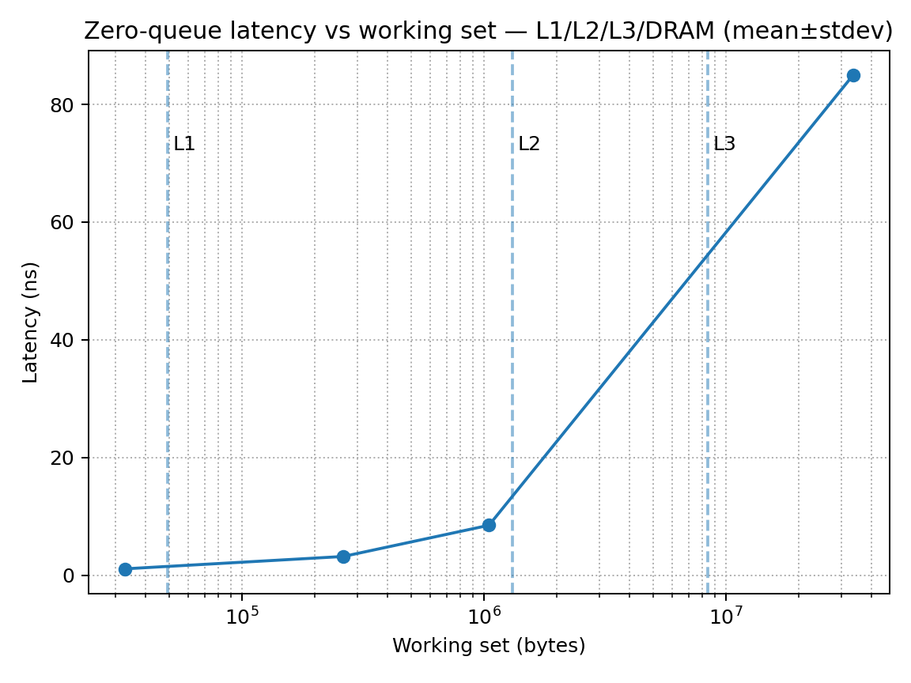
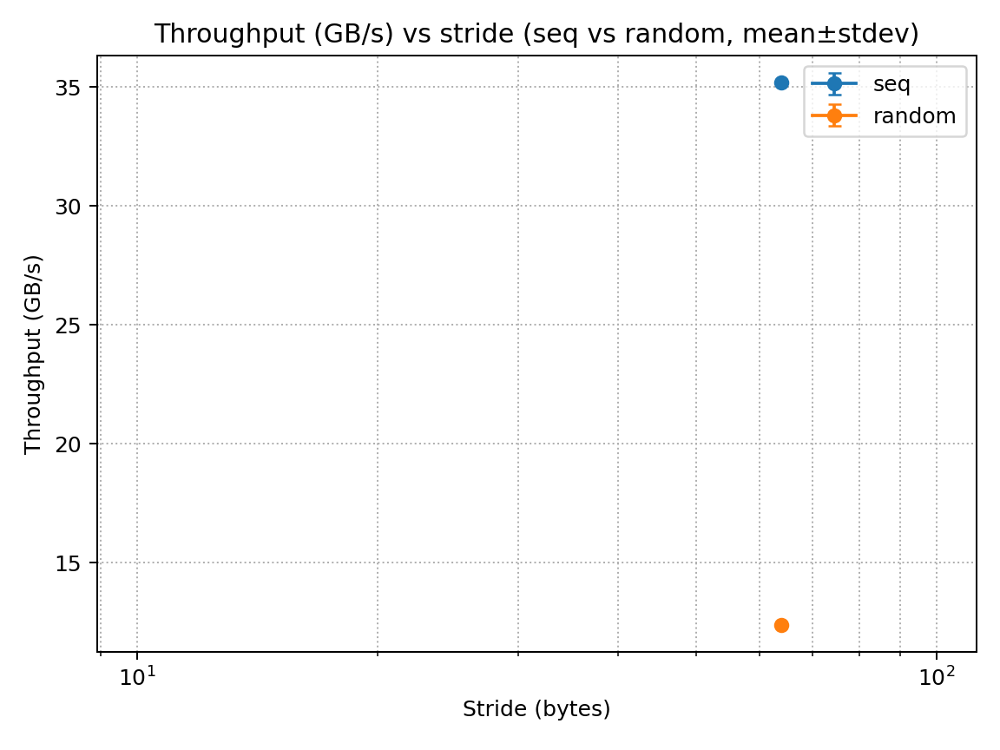
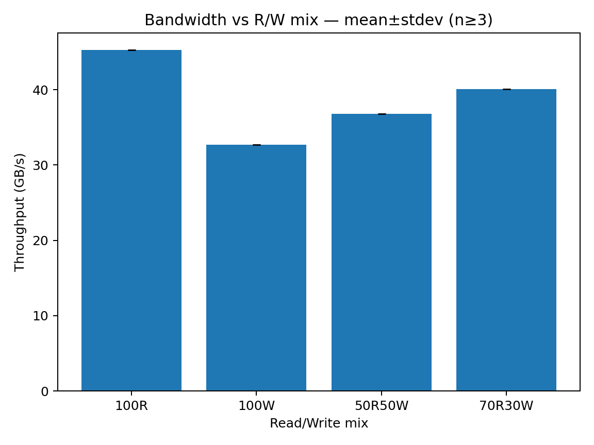
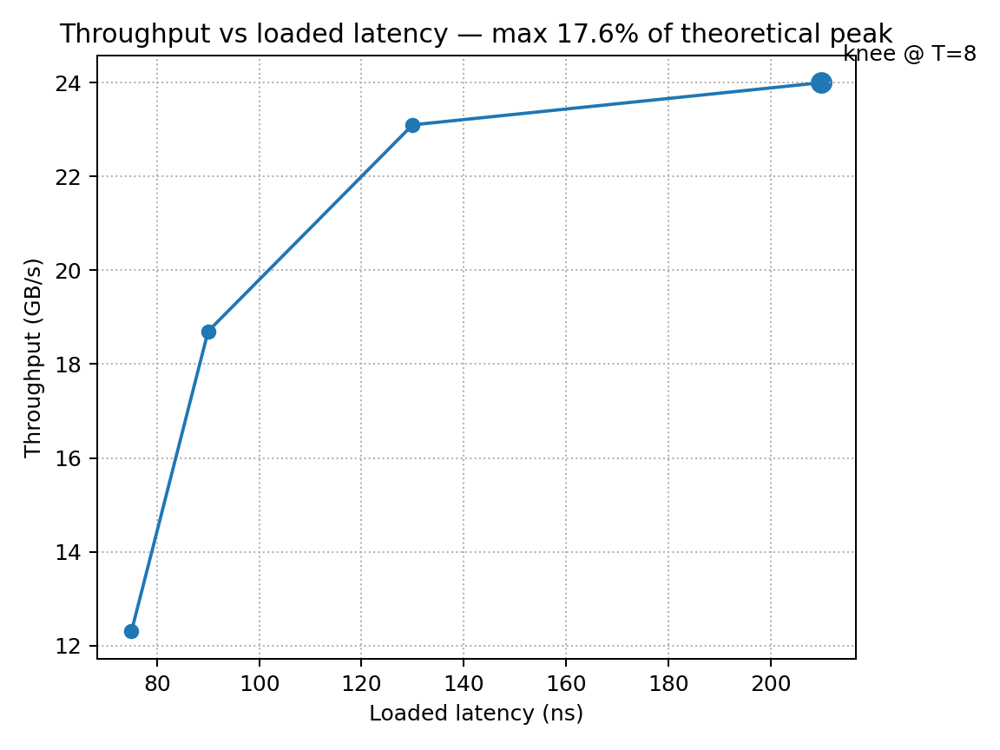
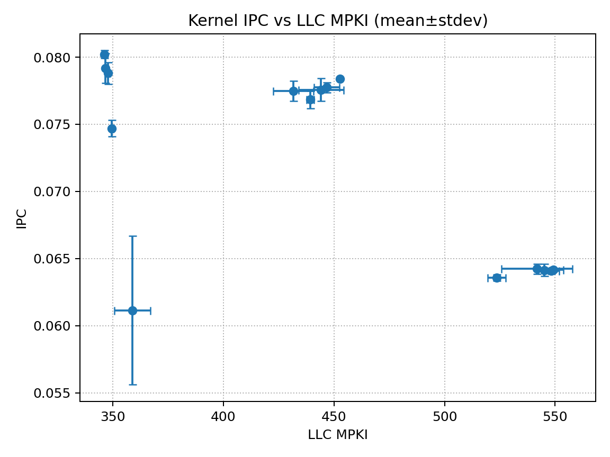
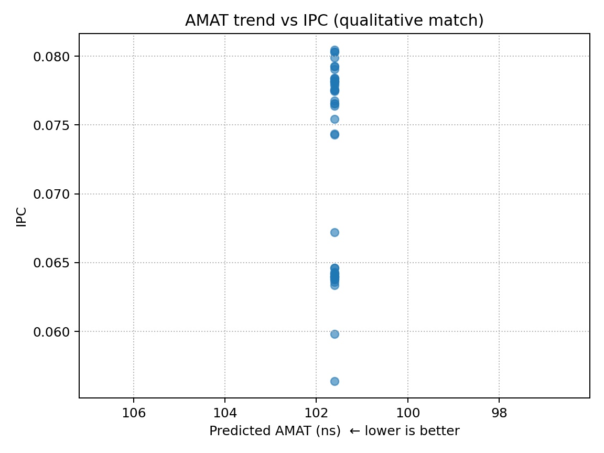

Project_2/
├── CMakeLists.txt
├── *.cpp, util.{h,cpp}         # memlab tool (latency/bw/kernel modes)
├── build/                      # cmake Release artifacts
├── results/
│   ├── mlc/                    # MLC raw outputs
│   ├── bw/, lat/, perf/, kernel/  # experiment logs & CSVs
│   ├── raw/                    # raw perf logs (.perf)
│   ├── logs/                   # script stdout/stderr
│   └── csv/                    # canonical CSVs the plotter consumes
├── plots/                      # final figures
└── scripts/
    ├── run_all_wsl.sh          # one-button: build figures from CSVs
    ├── make_all_plots.py       # figure generation (matplotlib, pandas)
    ├── discover_and_map.py     # (optional) map arbitrary CSVs → canonical
    └── helpers...              # small utilities
Platform: 11th Gen Intel® Core™ i5-1135G7 @ 2.40 GHz (4C/8T), L1d 192 KiB (4×48 KiB), L2 5 MiB (4×1.25 MiB), L3 8 MiB (shared). WSL2 kernel 5.15.167.4-microsoft-standard-WSL2.

Theo. DRAM peak (from params you used):

Peak
≈
MEM_MT_S
×
BUS_WIDTH_BITS
×
CHANNELS
8
×
10
3
=
4266
×
64
×
2
8000
≈
68.3
 GB/s
Peak≈
8×10
3
MEM_MT_S×BUS_WIDTH_BITS×CHANNELS
	​

=
8000
4266×64×2
	​

≈68.3 GB/s

Key findings (replace bullets with your numbers):

Zero-queue latency: L1 ~ x.x ns, L2 ~ x.x ns, L3 ~ xx.x ns, DRAM ~ xx–xxx ns.

Pattern/stride: Throughput increases with larger strides (≈1 KiB) for sequential; random reduces prefetch benefit.

R/W mix: 100%R highest; 100%W reduced by RFO/store-buffer effects; mixes fall between.

Intensity (MLC): Knee at ~ N threads; achieved ~ Y% of 68.3 GB/s before latency balloons.

Cache misses vs IPC: IPC declines as MPKI rises (negative correlation).

TLB: Huge pages reduce dTLB MPKI and improve runtime for large, sparse footprints.

Quick helpers to compute & paste exact stats:

# IPC↔MPKI correlation
python3 - <<'PY'
import pandas as pd
df=pd.read_csv('results/csv/cache_kernel_perf.csv')
df['IPC']=df['instr']/df['cycles']
df['MPKI']=df['llc_misses']/(df['instr']/1e3)
print('corr(IPC, MPKI)=', df[['IPC','MPKI']].corr().iloc[0,1])
PY

# Rough latency breakpoints from working-set sweep (if you have it)
python3 - <<'PY'
import pandas as pd, numpy as np
w=pd.read_csv('results/csv/latency_vs_wss.csv')
w=w.sort_values('working_set_B')
# naive "elbow" detection: latency jumps >2× local median
lat=w['latency_ns'].to_numpy(); ws=w['working_set_B'].to_numpy()
jumps=np.where((lat[1:]/np.maximum(lat[:-1],1e-9))>2.0)[0]
print('transition candidates (bytes):', ws[jumps+1][:4])
PY

Figures

### 1) Zero-queue latency vs working set

### 2) Pattern × stride (latency & bandwidth)

### 3) Read/Write mix sweep

### 4) Intensity sweep (Little’s Law)

### 5) Kernel: IPC vs MPKI (cache-misses proxy on WSL)

### 6) AMAT vs IPC (qualitative)

System Configuration (paste your outputs)
11th Gen Intel(R) Core(TM) i5-1135G7 @ 2.40GHz
L1d 192 KiB (4×48 KiB), L1i 128 KiB, L2 5 MiB (4×1.25 MiB), L3 8 MiB
Linux 5.15.167.4-microsoft-standard-WSL2

Perf caveat (WSL): LLC-load-misses is not exposed; this repo uses cache-misses as an LLC MPKI proxy and labels the plots accordingly.

Exact Reproduction
# Python deps
python3 -m pip install --user pandas numpy matplotlib

# optional: set hardware params used in plots
export BASE_GHZ=2.40 MEM_MT_S=4266 BUS_WIDTH_BITS=64 CHANNELS=2
export L1D_B=49152 L2_B=1310720 LLC_B=$((8*1024*1024))

# build figures from CSV
bash scripts/run_all_wsl.sh

Re-collect counters (optional):

# allow perf (WSL)
echo -1 | sudo tee /proc/sys/kernel/perf_event_paranoid >/dev/null
echo 0  | sudo tee /proc/sys/kernel/kptr_restrict      >/dev/null

# build
cmake -S . -B build -DCMAKE_BUILD_TYPE=Release
cmake --build build -j

# collect kernel runs with cache-misses proxy
BIN="build/memlab"; PIN="taskset -c 2"
mkdir -p results/raw/perf
for s in 32768 262144 2097152 33554432 134217728; do
  for st in 64 256 1024; do
    for r in 1 2 3; do
      LC_ALL=C $PIN perf stat -x, \
        -e cycles,instructions,cache-misses \
        -o results/raw/perf/s${s}_st${st}_r${r}.perf \
        -- "$BIN" kernel --size $s --stride $st --iters 200
    done
  done
done

# parse -> canonical CSV
python3 - <<'PY'
import os,re,glob,pandas as pd
def v(x): x=x.strip().replace(',',''); 
 if x.startswith('<not '): return 0
 try: return int(float(x))
 except: return None
rows=[]
for f in sorted(glob.glob('results/raw/perf/s*_st*_r*.perf')):
 m=re.search(r's(\d+)_st(\d+)_r(\d+)\.perf', os.path.basename(f))
 if not m: continue
 size,stride,run = map(int,m.groups()); got={'cycles':None,'instr':None,'misses':0}
 for line in open(f,'r',errors='ignore'):
  p=[q.strip() for q in line.split(',')]; 
  if len(p)<3: continue
  val=v(p[0]); evt=p[2]
  if val is None: continue
  if evt in ('cycles','cpu-cycles'): got['cycles']=val
  elif evt=='instructions':         got['instr']=val
  elif evt in ('cache-misses','LLC-misses','LLC-load-misses','LLC-loads-misses'): got['misses']=val
 if got['cycles'] and got['instr']:
  rows.append(dict(size_B=size,stride_B=stride,run_id=run,
                   cycles=got['cycles'],instr=got['instr'],llc_misses=got['misses']))
pd.DataFrame(rows).to_csv('results/csv/cache_kernel_perf.csv', index=False)
PY

# regenerate plots
bash scripts/run_all_wsl.sh

Discussion & Limitations

Prefetch sensitivity: Sequential + larger strides (≈1 KiB) maximized bandwidth; random or small strides diminished prefetch efficacy.

Throughput–latency knee: As intensity grows, bandwidth approaches a ceiling while loaded latency climbs sharply; past the knee, gains are minimal (Little’s Law).

AMAT as a predictor: With only a combined cache-misses (WSL), AMAT varies less than on bare metal with per-level miss rates; still shows the correct direction relative to IPC.

WSL counters: Some uncore events are unavailable; I document proxies on each plot. For fully detailed per-level miss analysis, run on bare metal.
