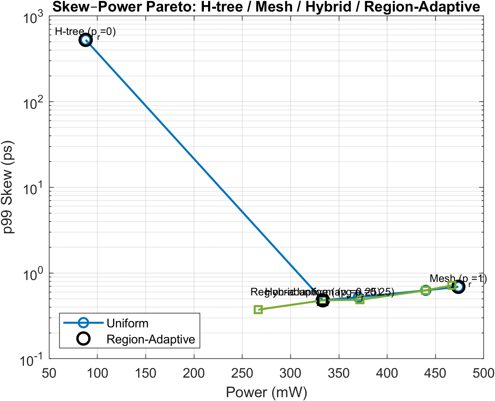
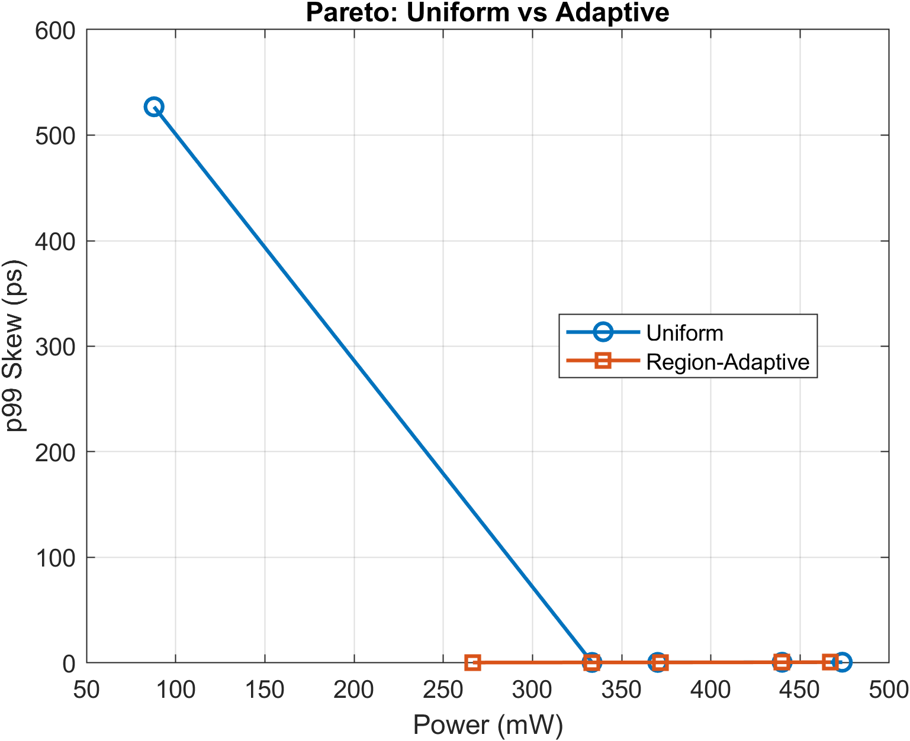
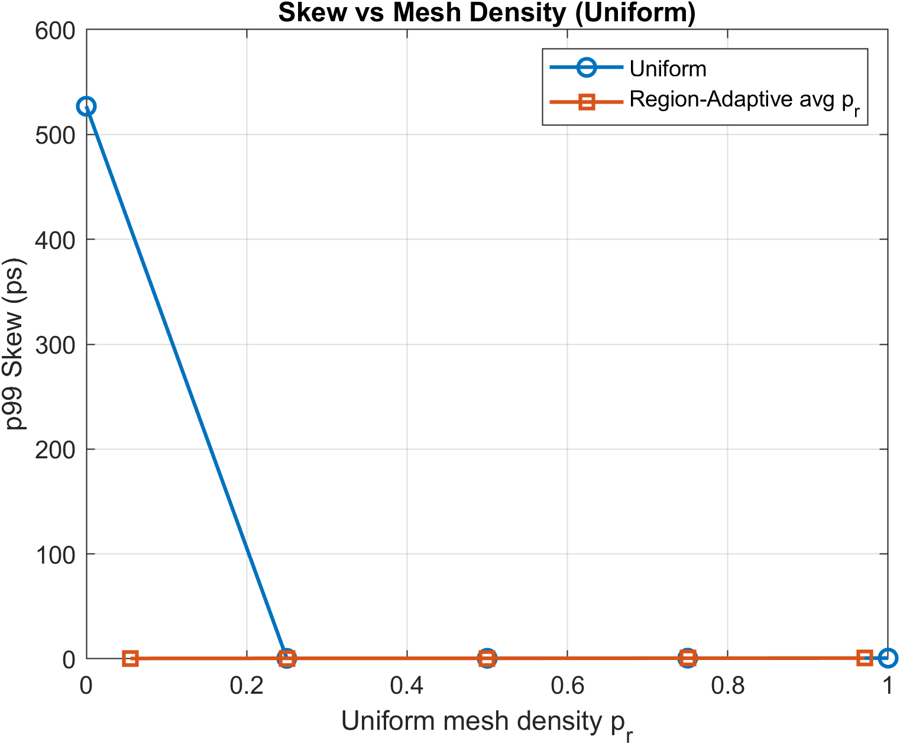
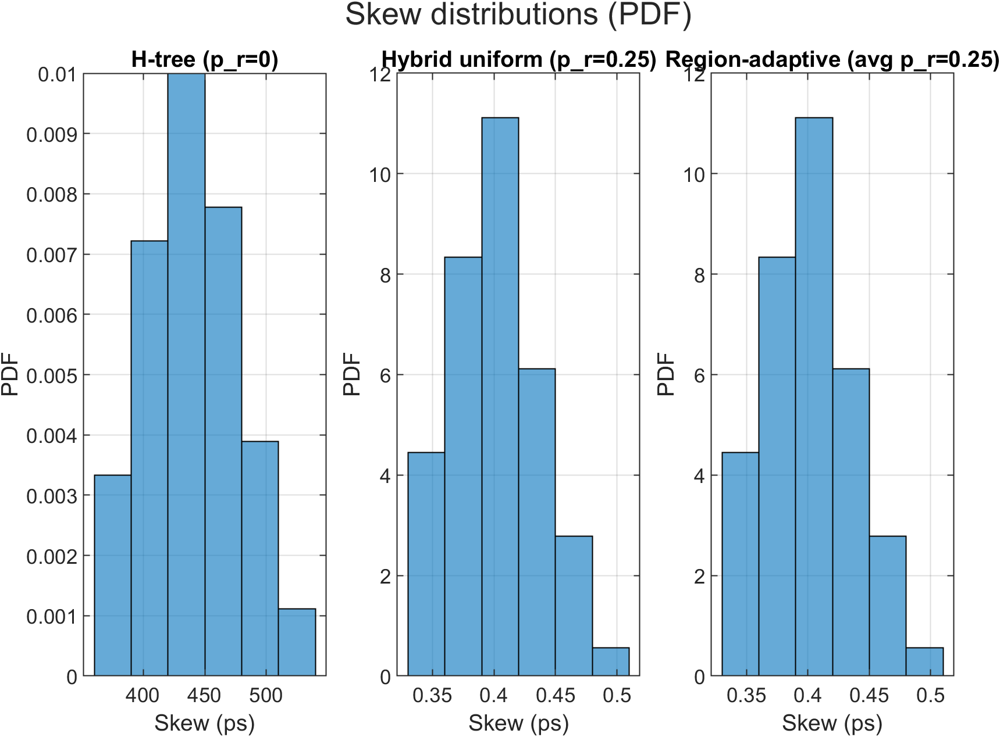
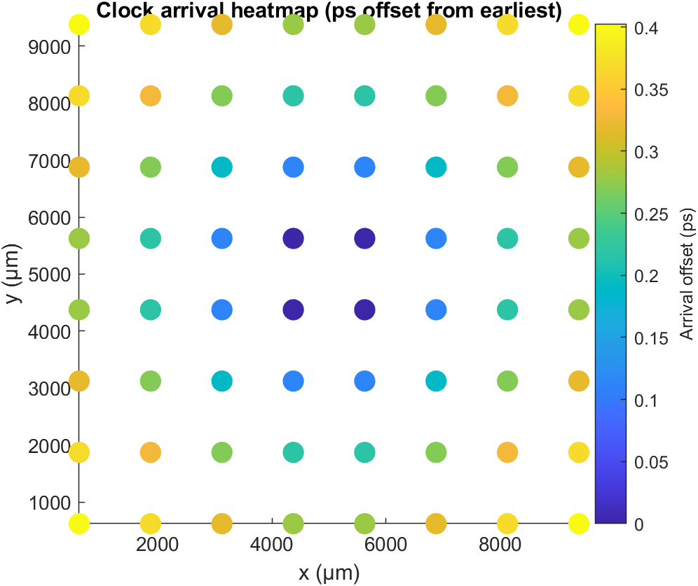

Different project than the listed options approved by Professor Zhang:
"Rubric"/guidelines set:
Hybrid Clock Network Design: H-Tree Backbone with Region-Adaptive Local Meshes

Background & Motivation
Clock distribution is a dominant power and timing challenge in modern multi-GHz SoCs.
Traditional topologies-H-trees (low power, higher skew) and meshes (low skew, high power)-represent opposite extremes.
This project explores a hybrid architecture combining an H-tree backbone with localized mesh clusters whose densities adapt to sink density or criticality, balancing skew, power, and robustness.
This research connects to Track B's architectural modeling and performance-analysis goals by quantitatively evaluating how microarchitectural (clock topology) and physical (wire RC) parameters interact to influence timing integrity, power, and variability.

Research Plan
1. Background Research
Review literature on H-tree, mesh, and hybrid clock topologies, including Intel's mesh designs and adaptive clocking papers (IEEE JSSC, TCAD).
Survey open-source tools and prior analytical RC modeling methods used for clock-network simulation.
Collect open parameters from IRDS/ITRS for 3 nm interconnect resistivity and capacitance.
2. Modeling & Simulation
Implement an analytical RC simulator in MATLAB/Python using Modified Nodal Analysis (MNA).
Generate an H-tree feeding tiled regions (e.g., 4×4). Within each region, create grid meshes with tunable mesh density prp_rpr​.
Perform transient analysis to compute sink arrival times → skew; estimate dynamic power P≈CV2fP ≈ C V² fP≈CV2f.
Introduce Monte-Carlo PVT variation on R′, C′, and R_drv to study robustness.
3. Analysis & Optimization
Sweep pr∈[0,1]p_r ∈ [0, 1]pr​∈[0,1] for uniform and region-adaptive cases.
Explore density and criticality-driven meshing policies.
Plot Pareto fronts of (skew vs power) and (skew robustness vs power).

Deliverables (End-of-Semester)
GitHub repository with full MATLAB/Python code, README, and reproducibility scripts.
Figures:
Skew-Power Pareto (H-tree vs Mesh vs Hybrid vs Region-Adaptive Hybrid)
Skew heatmaps across die regions
Robustness (p95/p99 skew) distributions
Final report summarizing:
Literature findings
Modeling methodology
Quantitative results and analysis
Insights for future adaptive clock design

Fit with Track B
This project has emphasis on combining:
Architectural modeling (clock-tree topology & optimization),
Performance analysis (skew, latency, power),
Algorithmic design (mesh-density optimization), and
Reproducible simulation methodology.

# Hybrid Clock Network Design: H-Tree Backbone with Region-Adaptive Local Meshes

## Overview

Clock distribution is a dominant contributor to power consumption, timing uncertainty, and robustness challenges in modern multi-GHz system-on-chip designs. Traditional clock distribution topologies represent two opposing extremes. H-trees are power-efficient and geometrically simple but increasingly sensitive to resistive imbalance and process variation. Clock meshes provide excellent skew robustness by averaging delays across many paths, but they incur significant dynamic power and routing overhead.

This project investigates a hybrid clock distribution architecture that combines a global H-tree backbone with localized clock meshes inside tiled regions of the die. The density of the local mesh is controlled by a single parameter, p_r ∈ [0, 1], which allows the design to smoothly interpolate between a pure tree and a dense mesh. In addition to uniform hybrid designs, this framework supports region-adaptive meshing, where local mesh density is redistributed based on clock arrival lateness while maintaining a fixed global budget.

The goal of this work is to quantify the skew, power, and robustness tradeoffs of hybrid clock networks using a reproducible analytical RC modeling framework, and to determine how much meshing is actually required to achieve near-optimal performance.

---

## Motivation and Fit with Track B

Clock networks are a canonical example of a system where architectural decisions directly interact with physical effects. Choices made at the architectural level strongly influence clock power, skew, and robustness long before detailed physical design or signoff analysis begins.

This project aligns strongly with Track B by emphasizing:

- Architectural modeling of clock distribution topologies  
- Quantitative performance analysis of skew, power, and robustness  
- Algorithmic exploration of mesh density allocation  
- Reproducible simulation methodology using analytical modeling  

The work focuses on extracting architectural insight rather than signoff-level accuracy, making it suitable for early-stage design space exploration.

---

## Modeling and Simulation Framework

The clock network is modeled using Modified Nodal Analysis (MNA). Each interconnect segment contributes resistance and capacitance proportional to its length, and clock drivers are modeled using a Thevenin equivalent. The system is simulated in the time domain using an implicit Euler method, allowing clock arrival times to be extracted at each sink.

Dynamic clock power is estimated using a CV²f formulation based on total switching capacitance. This is appropriate for architectural comparison since the clock toggles every cycle and relative capacitance dominates power trends.

Process and device variation are modeled using Monte Carlo perturbations applied to interconnect resistance, capacitance, and driver strength.

---

## Key Results

### Skew–Power Pareto Tradeoff



This figure shows the p99 skew versus average clock power for uniform mesh densities ranging from p_r = 0 (pure H-tree) to p_r = 1 (dense local mesh). The pure H-tree exhibits extremely low power but very large skew on the order of hundreds of picoseconds. Introducing sparse local meshes collapses skew by more than three orders of magnitude while increasing power modestly.

Beyond approximately p_r ≈ 0.25, additional meshing yields diminishing skew improvement while power continues to rise, indicating a clear knee in the design space.

---

### Uniform vs Region-Adaptive Hybrid Designs



This plot compares uniform hybrid designs against region-adaptive designs constrained to the same average mesh density. In this symmetric benchmark, region-adaptive meshing does not significantly outperform uniform meshing. This negative result is important and indicates that adaptive meshing is most beneficial in scenarios with spatial heterogeneity in sink distribution or load.

---

### Skew as a Function of Mesh Density



This plot highlights the relationship between mesh density and skew. Most of the skew reduction occurs at low mesh densities, confirming that dense meshing is unnecessary for effective skew control in many cases.

---

### Robustness Under Variation




Monte Carlo results demonstrate that hybrid clock networks significantly suppress skew tails under variation. While pure H-tree designs exhibit long skew tails, hybrid designs tightly bound skew even at high percentiles, improving robustness.

---

### Spatial Arrival Patterns



Arrival heatmaps provide a spatial view of clock timing across the die. Hybrid designs exhibit highly uniform arrival times, reinforcing the skew statistics and illustrating how local meshes equalize delay.

---

## Data Outputs

- `pareto_uniform.csv`  
  Uniform mesh density sweep results including skew and power metrics.

- `pareto_adaptive.csv`  
  Region-adaptive sweep results constrained to equal average mesh density.

- `sweep_results.mat`  
  Combined MATLAB output containing all parameters, tables, and results.

---

## Reproducibility

All results and figures can be regenerated by running the following command in MATLAB from this directory:

```matlab
run_all
